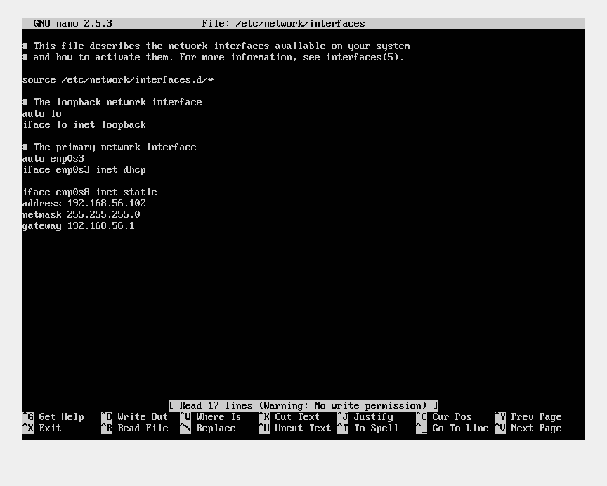

# SWAP
## Práctica 1
Para la práctica 1 he realizado la instalación de dos maquinas virtuales de Ubuntu Server 16. En la instalación tal y como se indicaba en el guión de la práctica 1 he señalado la instalación de OpenSSH para disponer de un servidor ssh al que poder conectarme y un servidor LAMP para disponer de servidor web.

Las máquinas virtuales tienen un nombre similar siendo la primera ubswap1 y la segunda ubswap2 con las cuales he realizado el mismo procedimiento de instalación y configuración. Se han configurado con una tarjeta de red NAT y otra en modo solo anfitrión, de esta manera podremos conectar con internet, entre las máquinas y la conexión con el host. 
Utilizando el comando ip addr podemos ver que la interfaz de NAT esta conectada y tenemos acceso a internet con ambas máquinas pero vemos que la interfaz enp0s8 no esta levantada y que ademas si lo intentamos veremos que no es posible ya que necesitamos configurar el fichero "interfaces" localizado en /etc/network/ de la manera que podemos ver en la imagen.

