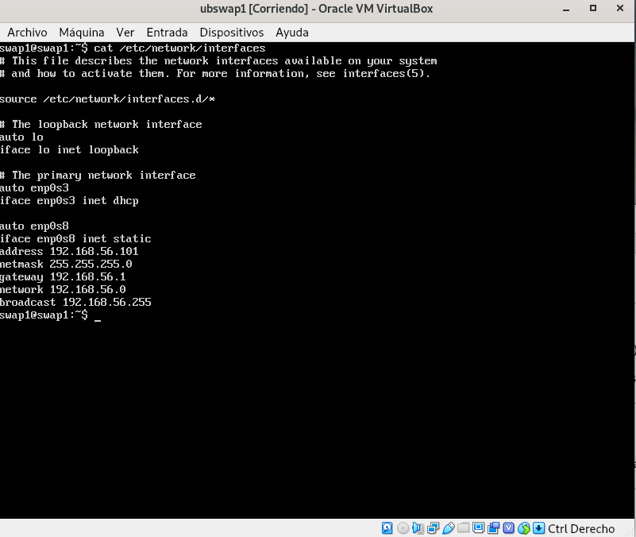
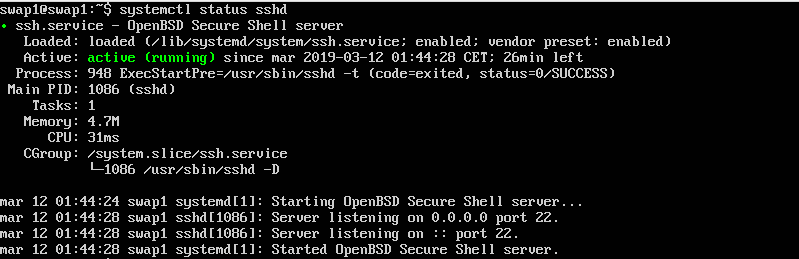
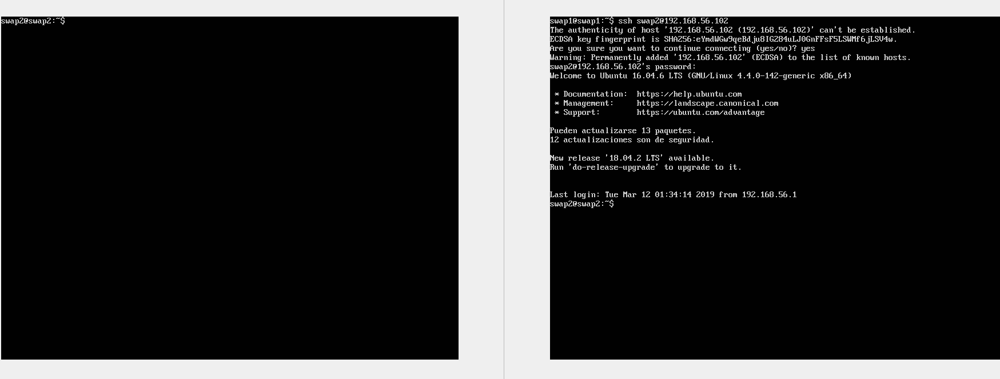
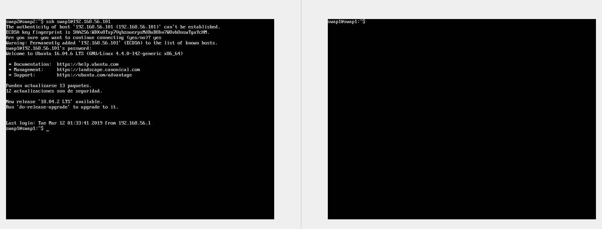
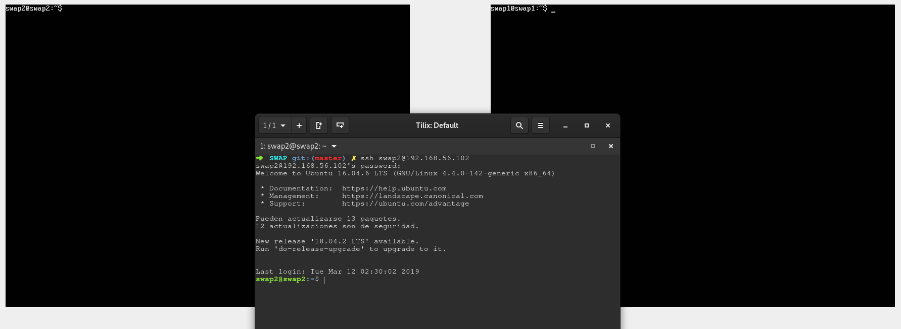
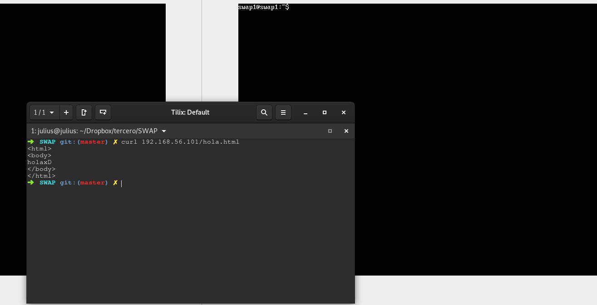
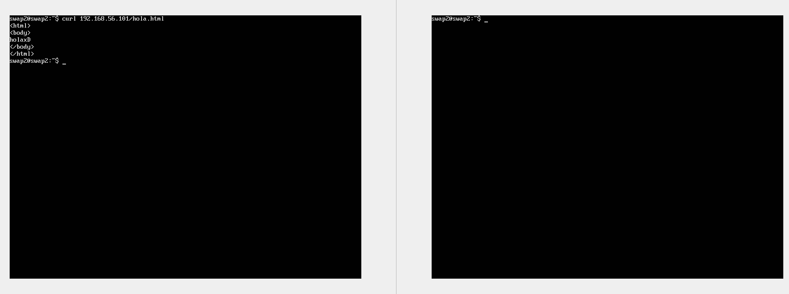

## Práctica 1
Para la práctica 1 he realizado la instalación de dos maquinas virtuales de Ubuntu Server 16. En la instalación tal y como se indicaba en el guión de la práctica 1 he señalado la instalación de OpenSSH para disponer de un servidor ssh al que poder conectarme y un servidor LAMP para disponer de servidor web.

Las máquinas virtuales tienen un nombre similar siendo la primera ubswap1 y la segunda ubswap2 con las cuales he realizado el mismo procedimiento de instalación y configuración. Se han configurado con una tarjeta de red NAT y otra en modo solo anfitrión, de esta manera podremos conectar con internet, entre las máquinas y la conexión con el host. 
Utilizando el comando ip addr podemos ver que la interfaz de NAT esta conectada y tenemos acceso a internet con ambas máquinas pero vemos que la interfaz enp0s8 no esta levantada y que ademas si lo intentamos veremos que no es posible ya que necesitamos configurar el fichero "interfaces" localizado en /etc/network/ de la manera que podemos ver en la imagen respectiva a la máquina 2. Para la máquina 1 sería similar solo que cambiando la dirección ip por la 192.168.56.101.

Una vez realizada la configuración usamos el comando systemctl restart networking para relanzar el servicio y si usamos el comando ip addr podremos ver que ambas están levantadas, además utilizaremos enable para que el servicio se inicie cuando la máquina encienda. 

Como habiamos instalado tanto LAMP como OpenSSH en el momento de la instalación deberemos comprobar que ambos servicios estan activos y lo que realizaremos será lanzar el comando systemctl status apache2 y systemctl status sshd como se muestra en las siguientes imágenes. 

Como podemos ver ambos servicios están activos y lo que haremos a continuación será ver que podemos conectarnos tanto desde el host como desde la otra máquina ubuntu server.

Ahora es el turno de verificar el servidor web para lo que realizaremos, siguiendo el guión, un archivo html en la siguiente ruta: /var/www/html/hola.html. Utilizaremos la herramienta curl para verificar el estado de la página que nos deberá devolver lo que hemos escrito en el archivo, en las siguientes imagenes podemos ver el procedimiento entre las máquinas y con el host:

