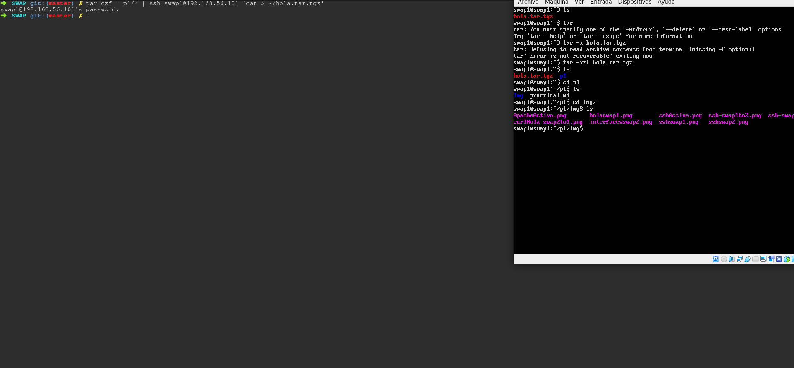
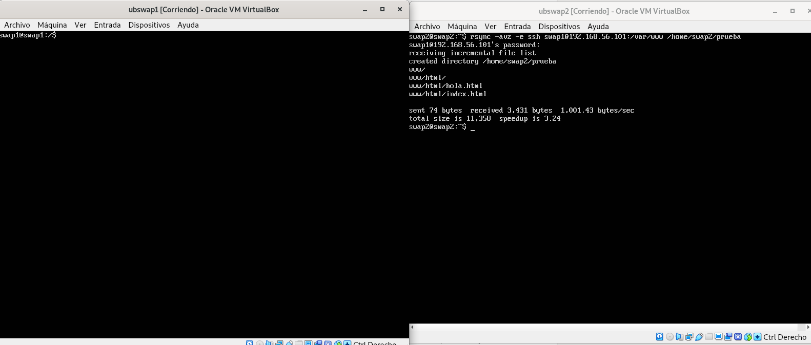
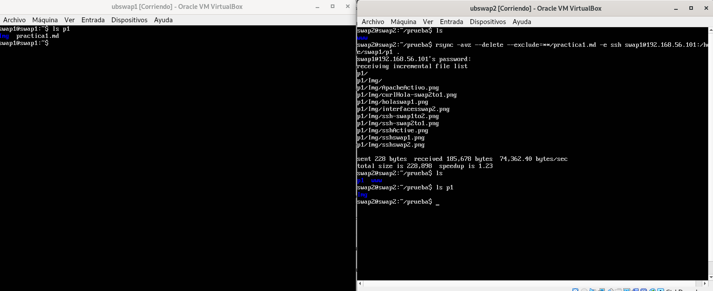
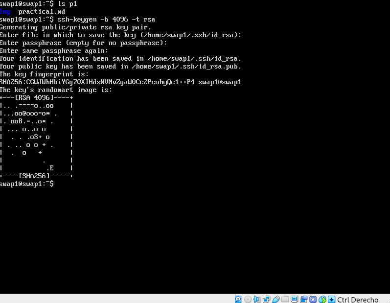
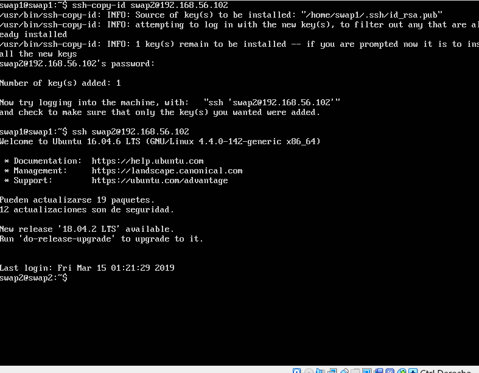
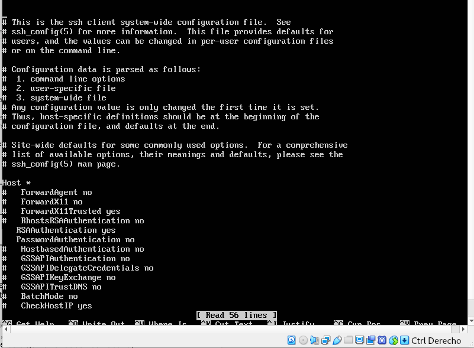
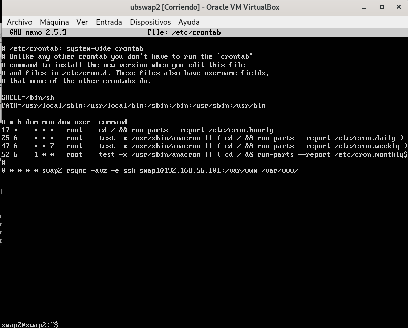

## Práctica 2
Para la práctica 2 lo que realizaremos será centrarnos en la copia de ficheros, copias de seguridad y automatización de estas.

Para comenzar se ha realizado la copia de ficheros y directorios de un equipo local a otro remoto por medio de las herramientas 'tar' para comprimir archivos y 'ssh' para enviar el archivo comprimido. En la siguiente imagen podemos ver como se realiza el comando y realiza correctamente la copia.

Se ha realizado una copia desde mi máquina personal a los servidores ya que dispongo de mas archivos banales para copiar. Se ha copiado explícitamente la carpeta p1 de la práctica 1 de SWAP y como podemos ver en la terminal se ha descomprimido el fichero tar.tgz y hemos entrado en las diferentes carpetas que componen el archivo copiado.

Para instalar rsync en mi sistema operativo "arch linux" lo he descargado del repositorio oficial mediante el comando pacman -S rsync.

Para la primera prueba se ha hecho un clonado desde la máquina 2 a la 1. En la imagen podemos ver que rsync si no existe la carpeta de destino la crea.

En el siguiente clonado utilizaremos el comando --delete con rsync que tiene la funcionalidad de borrar en el directorio de la máquina destino todo lo que no esté en la máquina de origen. Mucho cuidado con añadir esta función ya que podríamos perder datos sin quererlo.

Para no tener que poner la contraseña continuamente cuando queramos acceder desde nuestra máquina al servidor mediante ssh existe la posiblidad de acceder mediante clave publica/privada. Los primero que tenemos que hacer es crear nuestra clave publica/privada y luego copiar la clave pública al servidor desde el localhost. En las siguientes imágenes podemos ver en las siguientes imágenes.

Podemos ver que accedemos perfectamente sin necesidad de contraseña. Como medida adicional podemos hacer que no sea posible el acceso por contraseña modificando el archivo de configuración del servidor de ssh como se muestra debemos poner el acceso por contraseña a no y descomentar la autentificación por Rsa como se muestra en la siguiente image.

Por último para la automatización de los procesos podemos usar crontab. Vamos a hacer una prueba y se va a modificar el fichero en /etc/crontab para que ejecute el clonado con rsync cada hora. Una vez modificado debemos reiniciar el servicio de cron. En la siguiente imagen podemos apreciar como quedaría el fichero y el posterior reinicio.

Para finalizar puntualizar en en crontab existen palabras reservadas muy útiles como @hourly que ejecuta el comando cada hora o @daily/@midnight para que se ejecute una vez al día.