## Práctica 3

Para esta práctica se ha configurado una tercera máquina virtual la cual va a realizar las fucniones de balanceador de carga entre la máquina 1 y la máquina 2.

Nginx ha sido instalado mediante el gestor de paquetes que ofrece ubuntu y se ha realizado la configuración en el fichero /etc/nginx/conf.d/default.conf

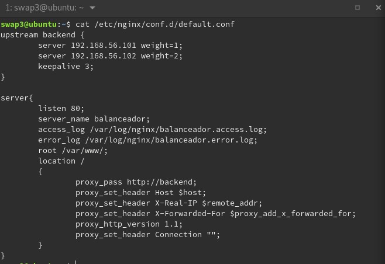

Como se puede apreciar se ha configurado para que la máquina 2 reciba el doble de peticiones que la máquina 1, así como la opción keepalive para obtener la persistencia de la sesión de los usuarios.

Podemos confirmar que la configuración esta correctamente hecha cuando el servicio aparece activo y sin errores.

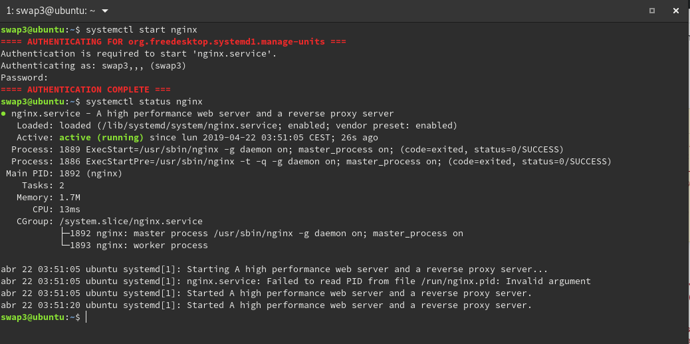

En la siguiente imagen podemos ver que el balanceador se comporta como esperabamos recibiendo la máquina 1 una petición por cada dos  que recibe la máquina 2.

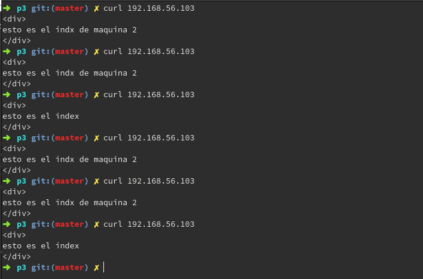

Para poder continuar con la configuración y activación de haproxy es necesario parar el servicio de nginx ya que usan el mismo puerto y son dos servicios dedicados a lo mismo.

Se ha creado un fichero de configuración en la ruta /etc/haproxy/haproxy.conf.

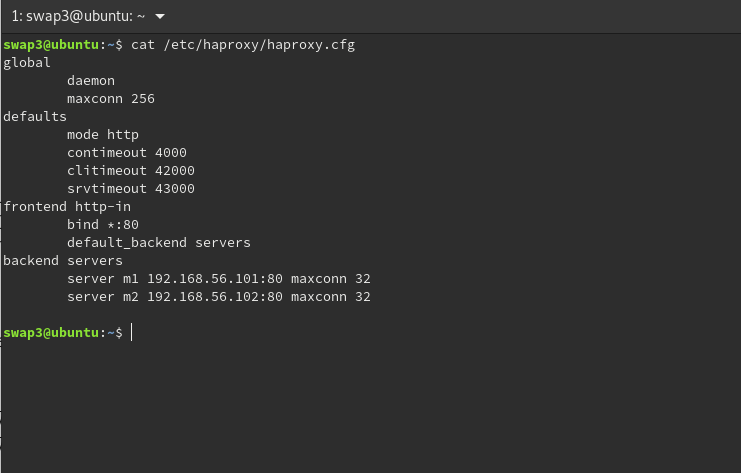

Podemos ver que el puerto en cuestión en el que recibiremos las peticiones como se ha indicado anteriormente es el puerto 80 y también podemos ver las dos IPs de las máquinas que vamos a utilizar para el balanceo de carga.

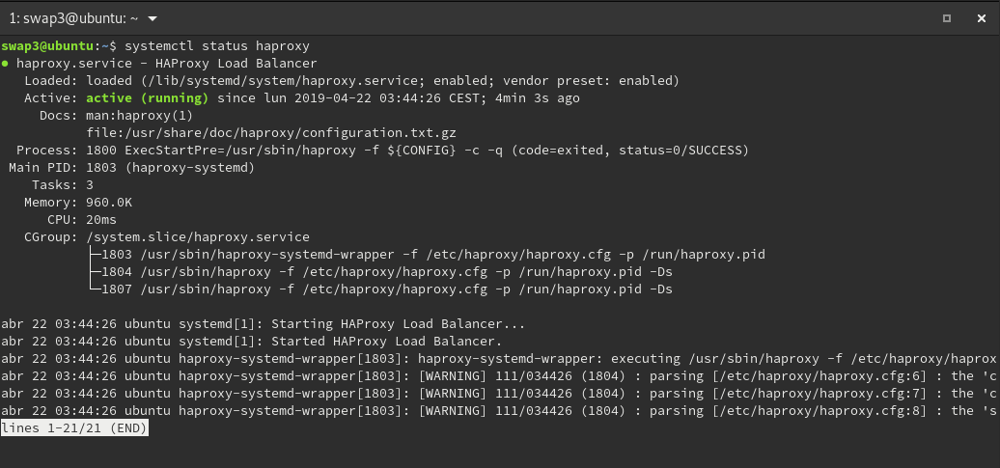

A continuación podremos comprobar que el balanceador haproxy realiza su función llevando a cada máquina una petición.

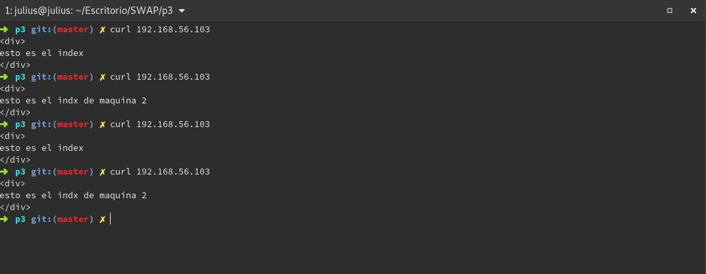

A continuación se va a realizar una comparativa entre ambos balanceadores. Comenzaremos con un test de 1000 peticiones para cada balanceador.

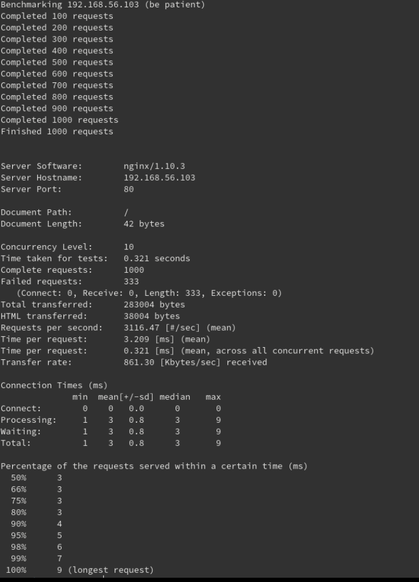

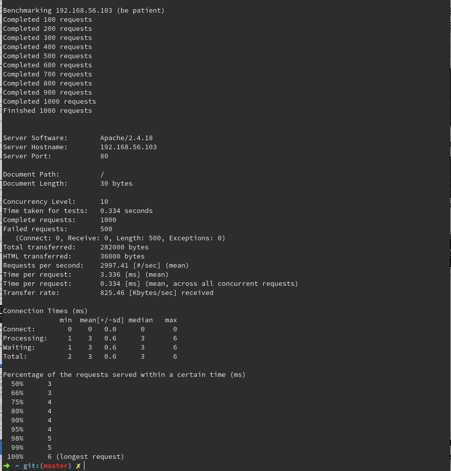

Podemos ver que con ambos balanceadores tienen prestaciones parecidas para esta prueba pero que nginx ha terminado de realizar el test ligeramente antes. Las diferencias que podemos apreciar son por ejemplo los fallos de las peticiones que haproxy ha tenido un numero mayor. Además nginx mantiene un número mayor de peticiones por segundo y menor tiempo por petición que haproxy.

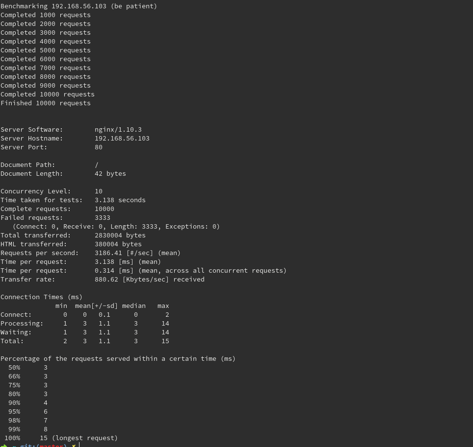

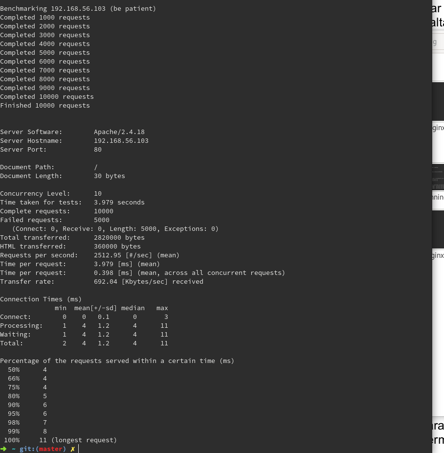

En este caso podemos ver similitudes con el ejemplo pero en este caso las diferencias en el tiempo que han tardado los test son un poco mas significativas ya que ahora nginx es casi un segundo mas rapido que haproxy, así como las peticiones por segundo y el tiempo por petición.

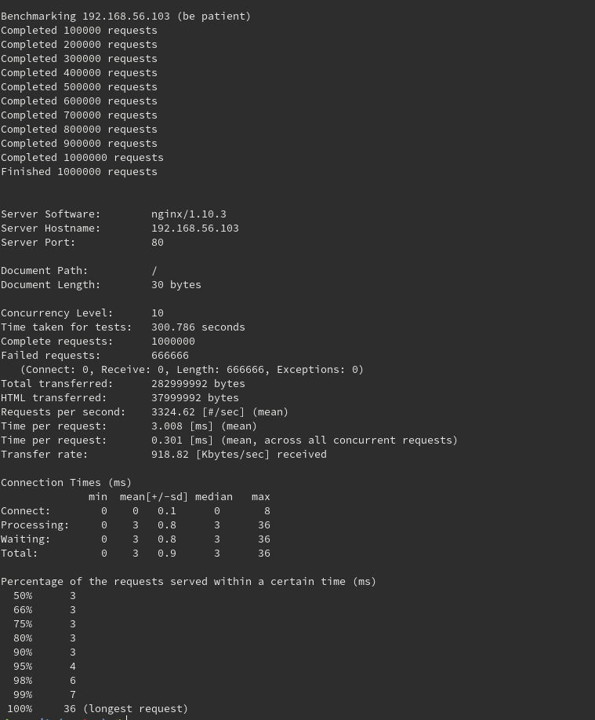

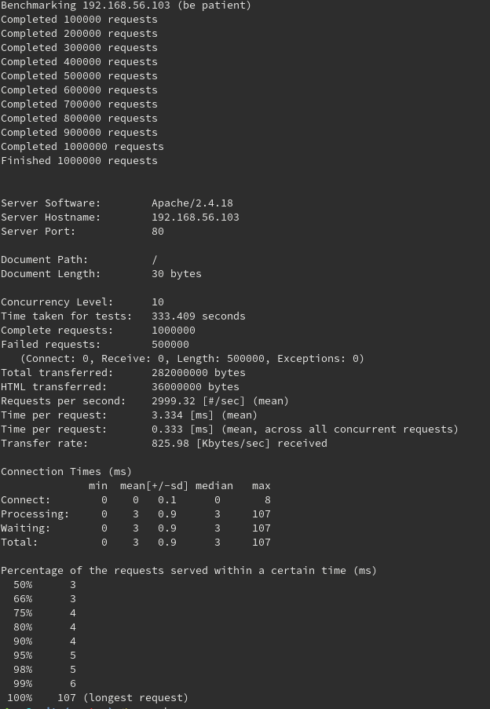

En esta prueba podemos confirmar los resultados anteriores ya que para una carga bastante grande ya existe una diferencia significativa entre ambos tanto en el tiempo en completar el test como en los tiempos por petición y la cantidad de peticiones por segundo.

También se ha realizado con top una revisión para ver la carga que generab. En la siguiente imagen podremos apreciar como la máquina 2 tiene un poco mas de carga que la máquina 1, así como en la máquina balanceadora tiene casi toda la carga de la cpu ocupada con el proceso de nginx.

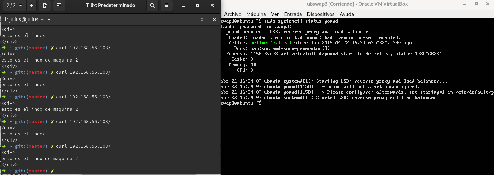

Como se puede apreciar se ha instalado como tercer balanceador Pound esta levantado y funciona correctamente. A continuación procederemos a realizar el test con ab y realizaremos una tabla con las diferencias encontradas entre los tres balanceadores con el mismo número de peticiones enviadas.

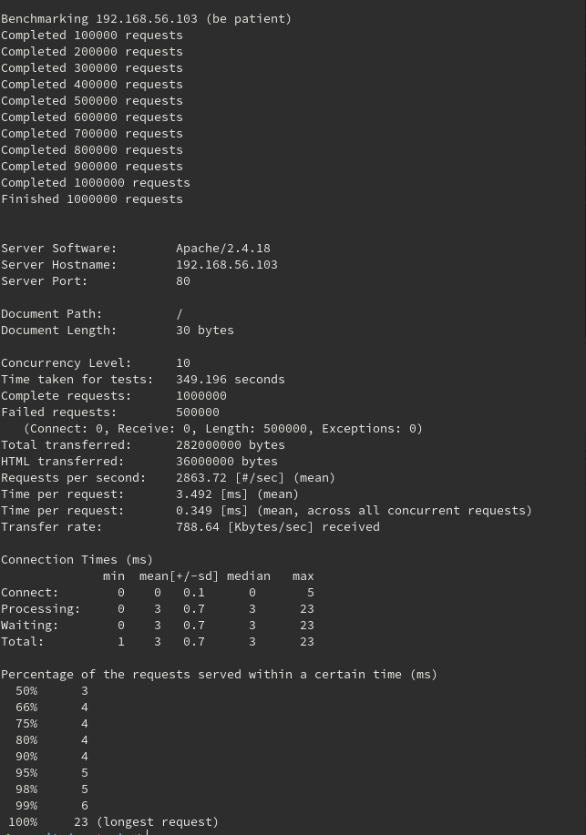

|                |    Nginx     |   Haproxy    |    Pound     |
| :------------- | :----------: | -----------: | -----------: |
|  Tiempo Total(s)  | 300.789   | 333.409    |     349.196    |
|  Peticiones/Seg | 3324.62     | 2999.32    |     2863.72    |
|  Tiempo por Pet(s) | 0.301       | 0.333    |    0.349      |

Analizando la tabla podemos concluir que para nuestro caso nginx nos ha dado mejores resultados, seguido por haproxy y por último pound.
