## Práctica 4

Para esta práctica se ha realizado la configuración de la granja web incluyendo los servidores finales y el balanceador nginx. 

### Configuración SSL

Este certificado garantiza a los clientes que visitan nuestra página web que somos fiables y somos los que decimos ser, para ello utilizaremos el nuevo estandar TLS ya que SSL ya no se utiliza.

Para conseguir un certificado podemos hacerlo tramitándolo a través de una entidad certificadora, hacer un certificado propio o utilizando el proyecto Certbot. Nosotros utilizaremos la segunda opción mediante el uso de openssl.

Para realizar este certificado se han utilizado los siguientes comandos.

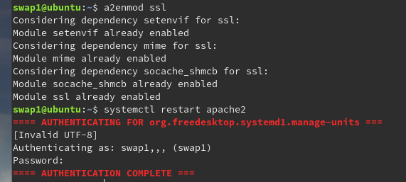
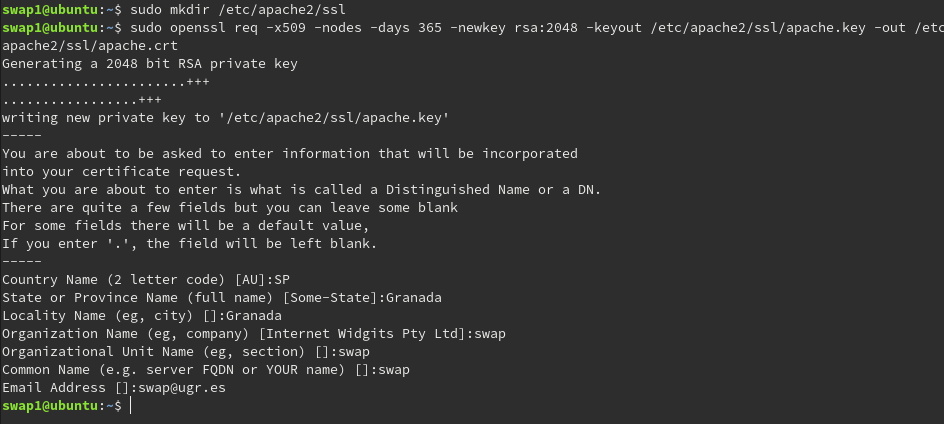

Podemos ver que ya estaba habilitado el módulo ya que lo realicé anteriormente. Para que nuestra máquina utilice el certificado ssl necesitaremos editar el archivo de configuración de ssl y reiniciar el servicio como se muestra en la siguiente captura.

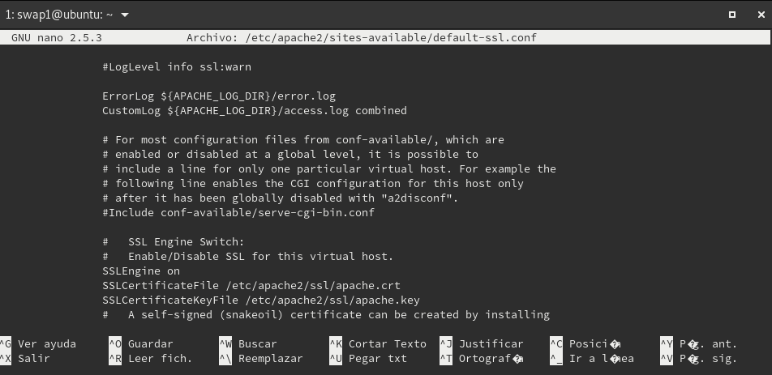

Añadiendo el path de donde hemos generado los archivos .crt y .key ahora debemos habilitar el sitio default-ssl y reiniciar el servicio de apache2.

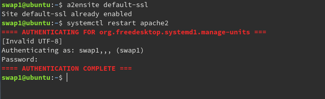

Una vez realizado esto podemos comprobar con curl que nuestra máquina recibe peticiones tanto por el puerto 80 como el 443 que es el utilizado por el protocolo ssl.

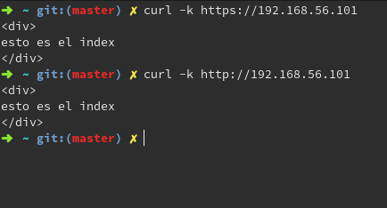

Para conseguir el mismo resultado tanto en la máquina 2 como en balanceador se va a realizar un copiado de los archivos generados para el certificado .crt y .key utilizaremos la herramienta rsync que aprendimos a usar en la prática anterior. En la captura siguiente veremos el proceso que se ha realizado para la máquina 2 que es el mismo que se ha utilizado para el balanceador.

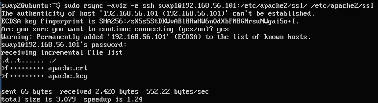

Una vez copiado en la máquina 2 podemos realizar los mismos pasos que se realizaron con la máquina 1 exceptuando la creación de un certificado nuevo, desde la activacion del módulo de ssl con a2enmod ssl hasta añadir el path al archivo de configuración. 

En el balanceador como utilizamos nginx debemos cambiar su configuración para que acepte las peticiones por el puerto 443 utilizando el certificado que hemos copiado de la máquina 1. El archivo de configuración quedaría de la siguiente manera:

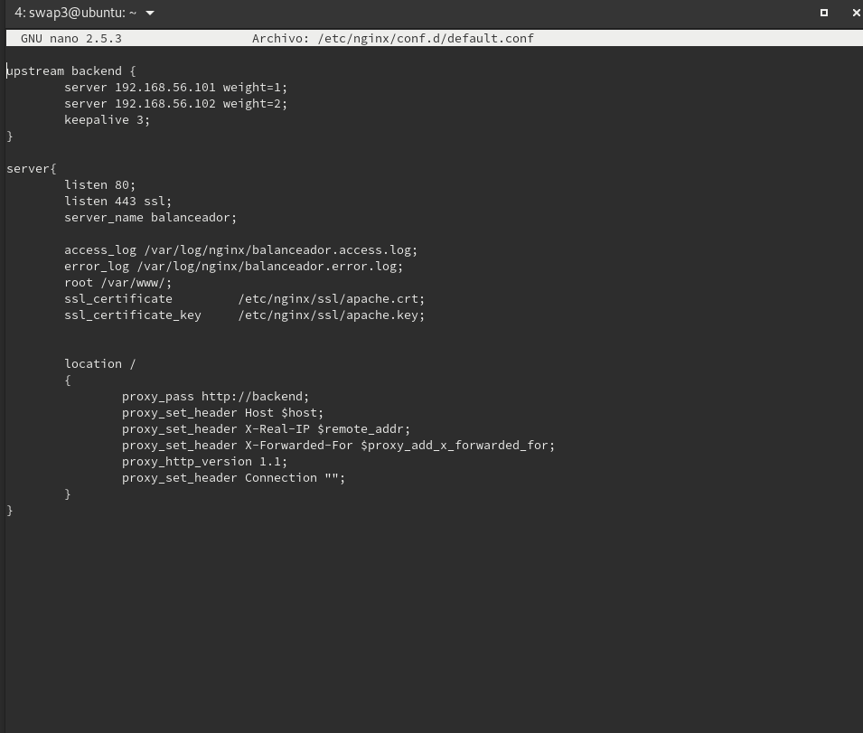

Para la realización de la primera parte opcional se ha quitado la claúsula ssl on que obliga a que solo acepte peticiones mediante https, si esta activa esta claúsula si intentamos entrar mediante http no nos dejará acceder devolviéndonos un error 400 de esta manera lo que conseguimos es poder acceder a las máquinas finales con ambos protocolos.

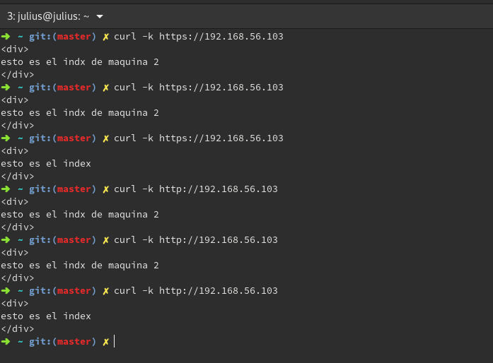

Como se ha podido comprobar se han realizado peticiones al balanceador con ambos protocolos sin ningún tipo de error. La opción -k se utiliza para que cuando curl vea que tiene un certificado el servidor al que realiza la petición, ignore la procedencia de este, en nuestro caso como es autofirmado sin esta opción nos lanzaría un error.

### Configuración del cortafuegos

Es necesario en una granja web, o en un servidor web tener configurado un cortafuegos que permita o deniege el tráfico para un determinado tipo de servicios o puertos. En este caso utilizaremos la herramienta iptables para configurar nuestro cortafuegos.

En una primera instacia borramos la reglas si las hubiera, siguiendo de una regla por defecto que denegar todo el tráfico y una vez configuradas las reglas para realizar estos procesos procederemos a configurar las reglas para permitir el tráfico por localhost y por los puertos que utilizaremos para entrar a nuestros servicios, en nuestro caso serán ssh, http, y https con sus respectivos puertos. Se ha configurado el script que se muestra en la siguiente captura, y se ha añadido un servicio a sistema que cada vez que se inicia el servicio de network en el arranque ejecuta el script.

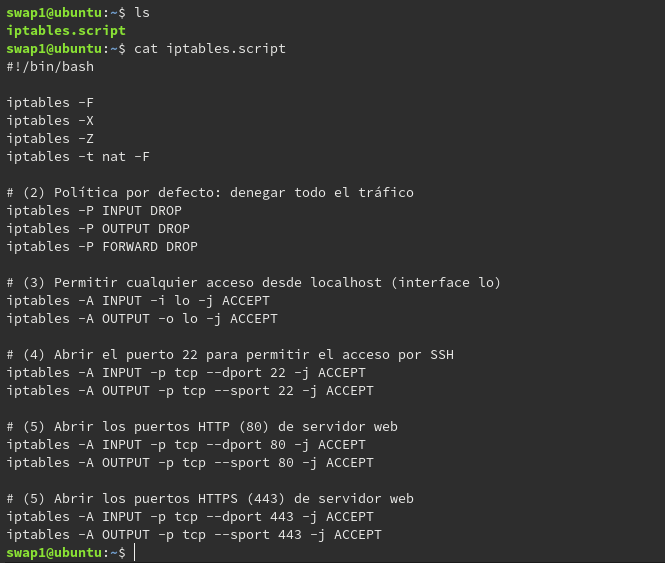

Para crear el servicio hemos creado el siguiente archivo:

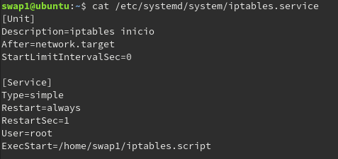

Este servicio como se ha indicado anteriormente mediante la claúsula After=network.target hace que se ejecute tras el inicio del servicio de network y ejecuta el archivo dado en el path en la claúsula ExecStart. Tras habilitarlo se ha reiniciado el sistema y podemos ver las reglas de las iptables configuradas para entrada y salida de los puertos que habiamos indicado en el script.

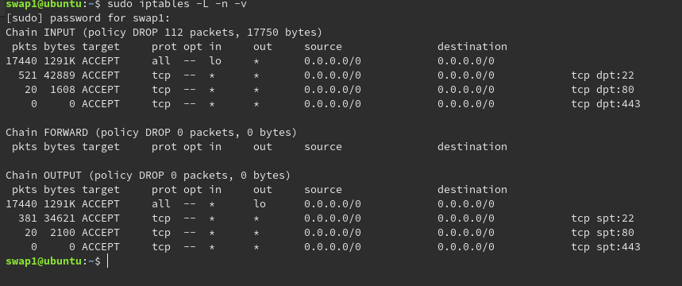 

