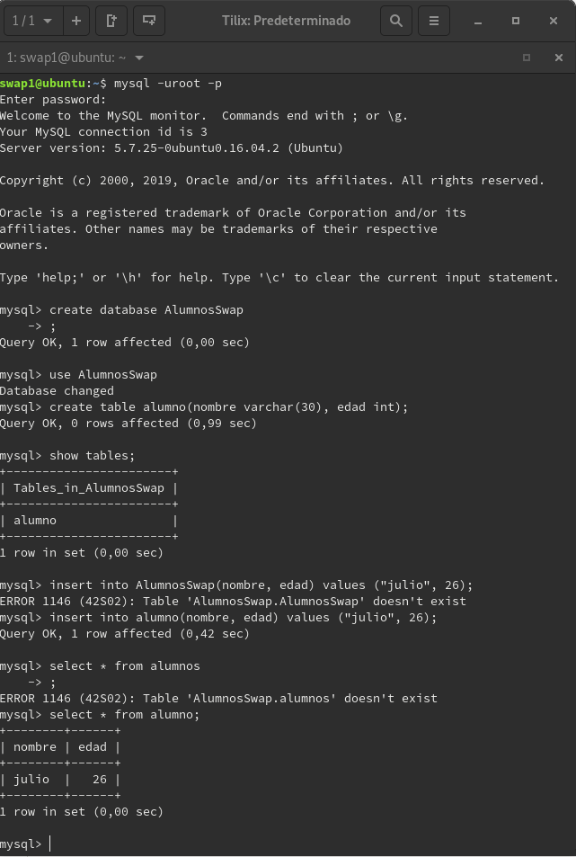

## Práctica 5

Para esta práctica queremos securizar nuestra base de datos realizando copias de seguridad mediante una réplica maestro-esclavo.

### Creación y modificación de BD

En una primera instancia crearemos unas base de datos a la cual le meteremos algunos datos como se muestra en la imagen.

Se ha realizado la adición de una base de datos, una tabla alumno con los parámetros nombre y edad. También se ha realizado la comprobación de que todo el proceso se ha realizado correctamente.

### Replicar una BD con mysqldump

A continuación utilizaremos la ayuda de una herramienta que tiene mysql que es mysqldump, con ella podremos realizar copias de seguridad de nuestras bases de datos. El volcado contiene la información que se ha usado para generar la base de datos que estamos replicando.

Primero evitaremos que se pueda acceder a la base de datos para que no pueda ser modificada y luego realizaremos la copia. Posteriormente dejaremos de bloquear la base de datos.

Una vez realizada la copia de la base de datos tendremos que realizar el traspaso de la copia de la base de datos a la máquina 2.

Como el archivo que hemos volado no es mas que texto plano con las sentencias que se han realizado para crear las tablas y los datos contenidos en la base de datos necesitaremos crear una base de datos preferiblemente con el mismo nombre para restaurar los datos.

### Replicación de BD mediante configuración maestro-esclavo

Para evitar realizar esto por un trabajador cada vez que necesitemos una copia de seguridad de nuestra base de datos mysql ofrece configurar un demonio para realizar estas tareas entre la máquina maestra y la máquina esclava de forma automatizada.

Se ha modificado el archivo de configuración para que deje de escuchar a un servidor, indicamos los ficheros de salida de los logs, damos un id de servidor y reiniciamos el servicio, realizando la misma operación para ambas máquinas solo cambiando el número de id.

A continuación se ha creado un usuario dentro de la máquina maestra que será el que podrá realizar la réplica.

Y en la máquina esclava realizaremos los cambios para decirle quien será el maestro y los datos del usuario y la base de datos.

En un primer momento cuando se ha realizado show slave status\G y Seconds_behind_master me salia el valor a null junto con un error de conexión el cual se debía a que la máquina maestra tenia las iptables activas y he tenido que abrir el puerto específico. Además al realizarlo una vez modificadas las iptables me daba otro error por lo que revisando me dí cuenta de que las posición de la base de mysql-bin estaba en la posicion 1224 en lugar de 501 por lo que cambié MASTER_LOG_POS= 1224. Una vez realizado esto inicio el esclavo de nuevo y salia el valor de seconds_behind_master a 0.

Ahora todo parece estar bien y realicé el cambio de añadir un campo a la tabla alumno, he añadido al alumno pepico con edad 22 y como se puede apreciar se han añadido en la máquina esclava.

